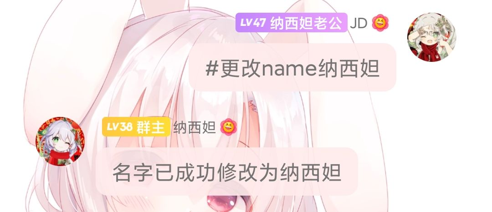
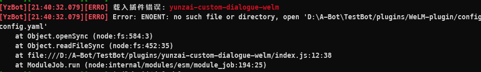

<!--
<p align="center">
  </a>
</p>
-->

<!--
兰罗摩: 没图了生草的一批有没有好心人给点图()
-->

<div align="center">

# WeLM Plugin

_🎉 基于 Yunzai-Bot 的 AI 对话插件 🎉_


---

## 访问量
[](https://gitee.com/shuciqianye/yunzai-custom-dialogue-welm/)

---

[](https://nodejs.org/en/download/)
[](../../../../Le-niao/Yunzai-Bot)
<br>
[](https://jq.qq.com/?_wv=1027&k=5jt6obxk)
[](https://jq.qq.com/?_wv=1027&k=oK3MF0lm)

<a href="#安装插件">安装教程</a>
·
<a href="#可能遇到的问题">大概率会遇到的问题</a>
·
<a href="#支持我们">支持我们</a>

</div>
<!--以上Html代码cv自渔火Arcadia的Ap-plugin-->

<!--
@Author: 渔火Arcadia  https://github.com/yhArcadia
@Date: 2022-12-22 00:38:21
@LastEditors: 渔火Arcadia
@LastEditTime: 2023-02-08 17:27:42
@FilePath: \Yunzai-Bot\plugins\ap-plugin\README.md
@Description: 版本：2.11.5

Copyright (c) 2022 by 渔火Arcadia 1761869682@qq.com, All Rights Reserved.
-->

## 简介
WeLM-plugin是一款在 QQ 内快速调用[WeLM](https://welm.weixin.qq.com/docs/tutorial/)提供的 API 接口进行多参数便捷 AI 对话的 [Yunzai-Bot](https://github.com/Le-niao/Yunzai-Bot) 插件, 此插件功能不断扩展中如有意见或新功能思想可在issues提出, 更多功能敬请期待......

## 安装插件

### 1. 克隆本仓库至plugins目录
在Yunzai-Bot根目录打开终端并选择一个执行   **_PS:如果不使用给出的命令安装插件包版可能会无法载入插件, 并且不要2个都执行!!!!!!!!!!!!!!!!!!!!!!!_**

- 使用Gitee（国内服务器推荐使用此方法）
```
git clone -b master --depth=1 https://gitee.com/shuciqianye/yunzai-custom-dialogue-welm.git ./plugins/WeLM-plugin
```

- 使用GitHub
```
git clone -b master --depth=1 https://github.com/JD1433223/WeLM-plugin.git ./plugins/WeLM-plugin
```

### 2. 安装必要依赖(axios)
_PS: 请在**Yunzai-Bot根目录**执行_
#### 使用npm
```
npm install axios --registry=https://registry.npmmirror.com
```

#### 使用pnpm
```
pnpm add axios -w
```

#### 使用cnpm
_PS: 需提前安装_
* cnpm安装指令
```
pnpm install -g cnpm -registry=https://registry.npm.taobao.org
```
* 安装依赖指令
```
cnpm install axios
```

### 3. 填写Token(否则大部分功能无法使用)
对机器人私聊"#填写token xxx"（这个xxx是你的API-Token） _如果没有去这个文档申请[WeLM申请文档](https://docs.qq.com/form/page/DUW1YVVJNbHpzV2No#/fill-detail)_ 


### 4. 填写预设
_PS: dhdata.txt在WeLM-plugin/data内_
需要在dhdata.txt内写入预设，预设内第1行输入给模型的提示信息，然后回车空一行，接下来写一段模拟的对话。强烈建议去看看去看那个[dhdata演示](./resources/README/markdown/dhdata.md)学习一下，如果再不理解可以到渔火的群蒙德幼儿园找一个叫"群傻逼时不时来问问题喵~"的人问一下。或者!!!如果你机器人也是纳西妲的话可以把演示里的复制粘贴到data/dhdata.txt直接开用(强烈建议自己研究下，我用的这个对话起来bug很多)

### 5. 填写机器人预设内名称
使用#更改name xxx把name改成和预设里面机器人要扮演的角色一样的名字


# 可能遇到的问题
## 缺少依赖


如果你使用的是pnpm可能会出现图上的错误请到上面的教程重新使用npm或cnpm安装
* [点我快速前往](#2-安装必要依赖axios)

## 插件名称错误


如果你遇到了图上的错误就证明你没有按教程来装,重新按**教程**来装即可

## 文本生成错误


如果你在使用功能时出现类似图上的错误有可能是以下错误:

超时：504
<br>
服务不可用：503
<br>
用户prompt命中敏感词：400
<br>
生成结果命中敏感词：200
<br>
用户输入参数不合法：400
<br>
配额超限制：429
<br>
请求频率超限制：429
<br>
Token不可用：403

* 详细请前往[Github的Wiki](https://github.com/JD1433223/WeLM-plugin/wiki/%E5%A4%A7%E5%A4%9A%E6%95%B0%E4%BC%9A%E9%81%87%E5%88%B0%E7%9A%84%E9%97%AE%E9%A2%98)查看

## 插件冲突
如果出现明明没有报错但是依然没有返回消息的话就说明你遇到插件冲突了
### 自检
1. 看看发送后有没有什么其他插件的指令被触发了
2. 如果有那就把它禁用了(更简单粗暴的话就把他删了)
3. 如果没有那建议来我们的交流群问问JD和书佬 在这里我放个[快速链接](#宣个群如果有未知的bug可以来这里反馈也可以把他当成交流群来用)

# 使用说明
## 个性问答

### 普通对话

#### 简介
* 使用api生成对话(dhdata相当于聊天记录AI需要使用dhdata进行学习, 不填写会更蠢)

#### 如何使用?
_PS: 需提前填写dhdata.txt, 不填写无人设, 填写格式请看下面_
* 指令`welm`
* 指令格式: `welmxxxx`

#### 前置: dhdata.txt
* 填写格式: 
```
人设

我: xxx
机器人名字: xxx
```
* 条件: 
1. 不可超过2048字
2. 不可使用敏感词, 否则会出现400报错

* 如:
```
纳西妲的名字叫纳西妲，是须弥的守护神，500岁了，我是一位身材矮小的白发萝莉，身披绿色披风，让整体看上去变得更加的可爱。虽然是须弥地区中年纪比较小的一位草神，但是她并没有停下脚步，一直在不断学习去提升自己。

我:初次见面
纳西妲:初次见面，我已经关注你很久了。我叫纳西妲，别看我像个孩子，我比任何一位大人都了解这个世界。所以，我可以用我的知识，换取你路上的见闻吗？
我:你有什么感受
纳西妲:果然要亲眼去看，才能感受到世界的美。
我:下雨的时候…
纳西妲:快去避雨吧，小心头顶上长出蘑菇哦。
我:阳光很好…
纳西妲:天气真好啊，暖洋洋的，我们的身边马上也要热闹起来了。
我:早上好…
纳西妲:早上好，我们赶快出发吧，这世上有太多的东西都是过时不候的呢。
我:中午好
纳西妲:午休时间到，我想喝树莓薄荷饮。用两个和太阳有关的故事和你换，好不好？
我:晚上好
纳西妲:太阳落山啦，我们也该把舞台让给夜行的大家族了。
我:晚安
纳西妲:快去睡吧，放心，我已经为你准备好甜甜的梦啦。
```
_PS: 以上采自[dhdata演示](resources/README/markdown/dhdata.md)_

#### 示例


#### 超鸡旧之前的效果(JS版时代)
* [☞快速跳过](#连续对话)因为这个图太tm长了()
<br>
巨久之前测试的，那时候无需100%触发指令，现在要放这个单纯为了表扬一下WeLM和装个逼 :smirk:


### 连续对话

#### 简介
* 使用api与jldata进行生成对话

#### 如何使用?
_PS: 人设需要在jldata.txt提前填写_
* 指令: `lxdh`
* 指令格式: `lxdhxxx`

## 提问

#### 简介
* 使用你的问题向ai提问

#### 如何使用?
* 指令: `提问`
* 指令格式: `提问xxx`

#### 示例


## 续写

#### 简介
* 让ai使用你发送的文本进行续写

#### 如何使用?
* 指令: `续写`
* 指令格式: `续写xxxxxxx`

### 阅读理解

#### 简介
* 让ai使用你发送的文本进行阅读理解

#### 如何使用?
* 指令: `阅读理解`
* 指令格式: `阅读理解xxxxxxxxxxxx`

### 海龟汤

#### 简介
* 让ai和你玩海龟汤的猜谜游戏吧

#### 如何使用?
1. 使用指令`写汤底xxxxxx`(xxxxxx为汤底的内容) _PS: 必须在私信填写(不然都让别人看到了你还玩个毛啊啊啊)_
2. 使用指令`写汤面xxxxxxx`(xxxxxxx为_汤底的提示_)  _PS: 必须在私信填写(不然都让别人看到了你还玩个毛啊啊啊)_
3. 然后你就可以在群内和ai玩海龟汤了~ 指令是: `请问xxxx`

#### 小贴士
* 如果需要海龟汤的答案请使用指令(会清空汤底): `看汤底`
* 如果需要海龟汤的提示可使用指令: `看汤面`

### 更改机器人在人设中的名字

#### 简介
* 如题

#### 如何使用?
* 使用指令: `#更改namexxx`
 **注意，此name要与预设内机器人扮演的角色的名字一致，否则将会导致返回空信息或者极度奇怪的话语** 

### 填写Token

#### 简介
将在配置文件内的token替换为指令的token(前提为token可用)

#### 如何使用?
* 使用指令: `#填写tokenxxxxxxxxxxxxxxxxxx`

# 贡献者名单
| 贡献者 | 联系方式 | 主要贡献 |
| --- | --- | --- |
| 🎭书辞千楪Sama🌴 | QQ: `1700179844` | 提供了插件的主要功能 |
| JD | QQ:`1461072722` | 提供了插件的部分功能 |
| 兰罗摩 | QQ: `3584075812` | 将插件更改为插件包结构并支持锅巴 |
| 鸢 | QQ: `2166683295` | 提供了写入.yaml后缀名文件的技术 |
| 曉K | QQ: `1509293009` | 添加了`#welm版本`指令 |
| [喵喵插件](https://gitee.com/yoimiya-kokomi/miao-plugin) | 仓库: `https://gitee.com/yoimiya-kokomi/miao-plugin` | 提供了图片帮助功能 |
| [椰奶插件](https://gitee.com/yeyang52/yenai-plugin) | 仓库: `https://gitee.com/yeyang52/yenai-plugin` | 提供了更新功能 |
| [拓展插件](https://gitee.com/SmallK111407/expand-plugin) | 仓库: `https://gitee.com/SmallK111407/expand-plugin` | 提供了锅巴配置的技术 |
| [小叶插件](https://gitee.com/xiaoye12123/xiaoye-plugin) | 仓库: `https://gitee.com/xiaoye12123/xiaoye-plugin` | 提供了初始化的JS代码 |
| [Ap插件](https://gitee.com/yhArcadia/ap-plugin) | 仓库: `https://gitee.com/yhArcadia/ap-plugin` | 提供了index的缺少依赖提示与README.md的Html代码 |
| **使用着本插件的你** | 你就是你自己 | **在背后默默支持着本仓库** |

# 声明
此项目仅用于学习交流，请勿用于非法用途, 如有侵权立即删除

# 更新日志
☞[点我前往查看](./CHANGELOG.md)

# 其他

### 宣个群(如果有未知的bug可以来这里反馈,也可以把他当成交♂流群来用)
群1: 
```
815638467
```
群2: 
```
712074725
```
### 前往其他代码托管平台内本仓库
* [☞GitHub](https://github.com/JD1433223/WeLM-plugin)/[☞Gitee](https://gitee.com/shuciqianye/yunzai-custom-dialogue-welm/)

### 前往其他仓库
#### Yunzai-Bot插件库:
* [☞GitHub](https://github.com/yhArcadia/Yunzai-Bot-plugins-index)/[☞Gitee](https://gitee.com/yhArcadia/Yunzai-Bot-plugins-index)

#### Yunzai-Bot
* [☞GitHub](https://github.com/Le-niao/Yunzai-Bot)/[☞Gitee](https://gitee.com/Le-niao/Yunzai-Bot) 

### 支持我们
如果你喜欢这个项目, 请不妨点个 Star🌟, 这是对开发者最大的动力, 当然, 你可以对我们进行赞助~

* [兰罗摩](https://afdian.net/a/Arama)

* [书辞千楪](https://afdian.net/a/0906-12)  [微信](https://img1.imgtp.com/2023/02/16/MdDza14P.png)&[支付宝](https://img1.imgtp.com/2023/02/16/luH0pKxj.jpg)